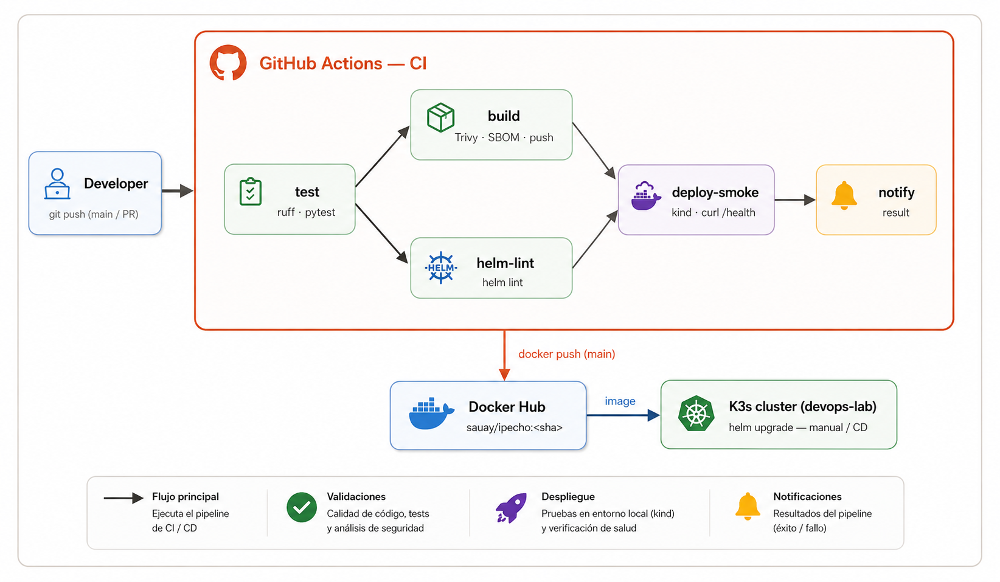
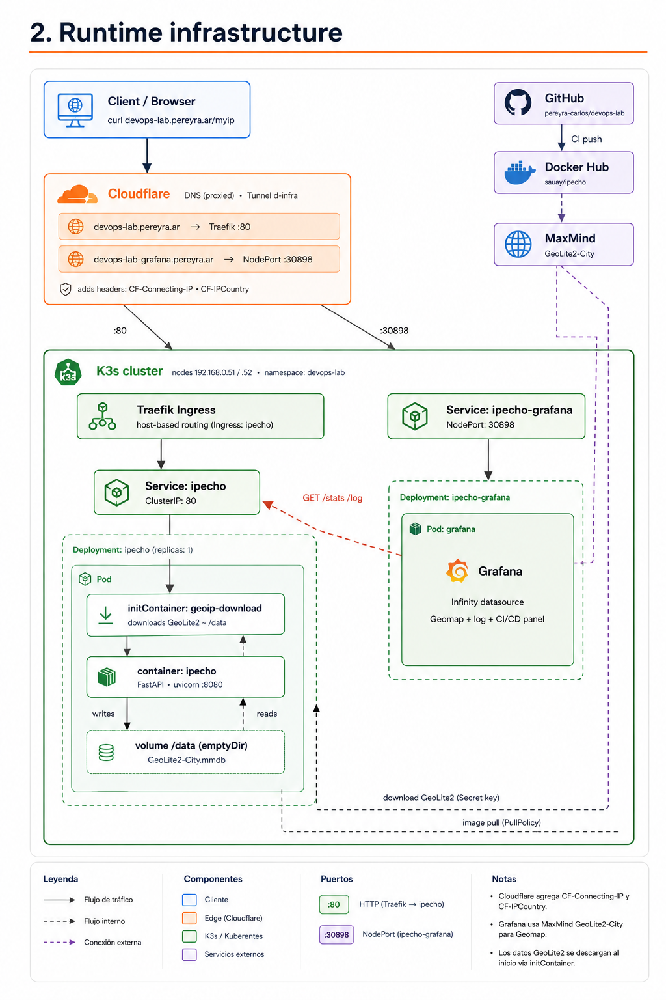
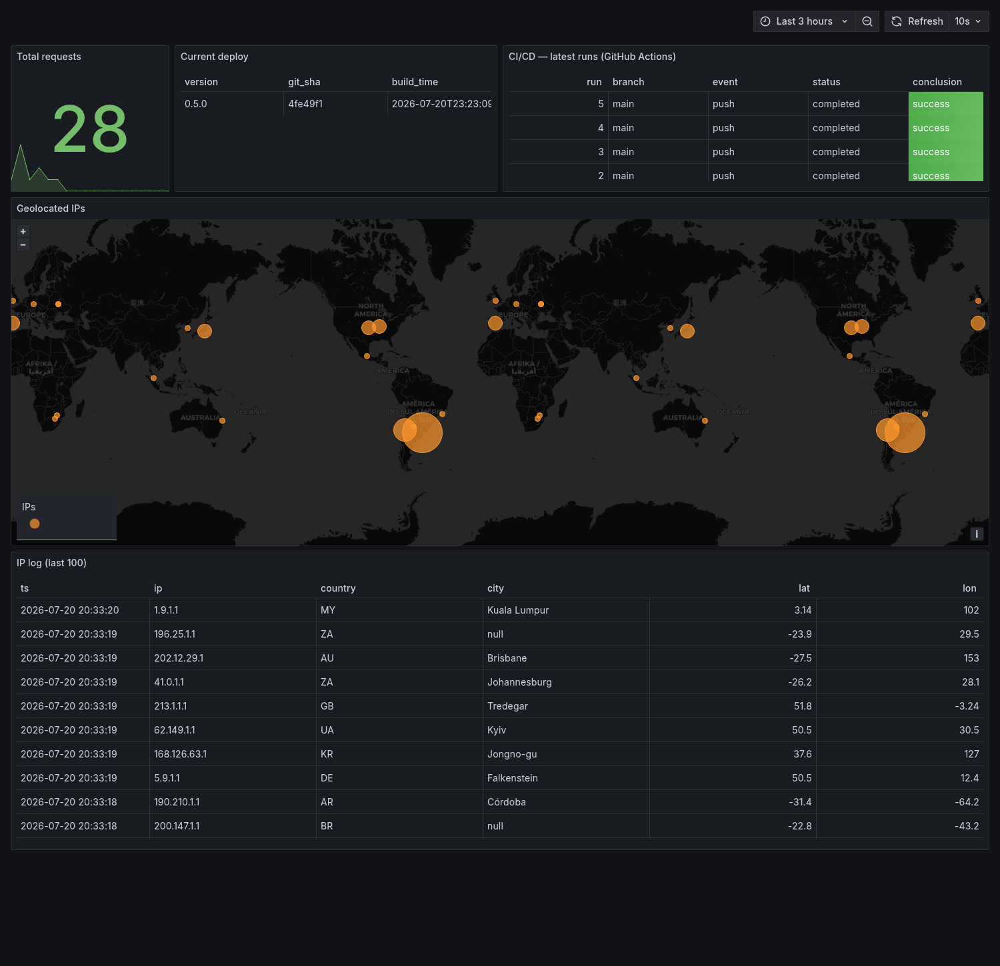

# lab-devops — ipecho

Minimal web app that returns the **client's originating IP**, wired to an end-to-end CI/CD pipeline: lint → tests → build → scan → push → helm lint → deploy → smoke test.

Built as a DevOps practice lab for interviews.

## Architecture

### CI/CD pipeline



### Runtime infrastructure



## Try it live

The app and its dashboard are running publicly. Hit the endpoint and watch yourself show up on the map:

```bash
# your public IP, as plain text
curl https://devops-lab.pereyra.ar/myip

# full JSON: IP + country + city + coordinates
curl https://devops-lab.pereyra.ar/
```

Every request is geolocated (from `CF-Connecting-IP` + GeoLite2) and appears **automatically** on the live dashboard within ~10 seconds — a new marker on the world map and a row in the IP log. Hover a marker to see the IP behind it.

**Dashboard → https://devops-lab-grafana.pereyra.ar**



## Documentation

Detailed technical write-ups (PDF, English):

- [Infrastructure & Pipeline](docs/00-infrastructure.pdf) — architecture diagrams: the CI/CD flow and the runtime topology (Cloudflare, GitHub, Docker Hub, K3s ingress/deployments/pods)
- [CI/CD Pipeline](docs/01-cicd-pipeline.pdf) — every pipeline stage, secrets, and the real troubleshooting story
- [The Python Application](docs/02-python-application.pdf) — endpoints, client-IP resolution, geolocation, metrics
- [The Helm Chart](docs/03-helm-chart.pdf) — values, security hardening, and the GeoLite2 init container
- [The Grafana Dashboard](docs/04-grafana-dashboard.pdf) — the panels, the Infinity datasource, and how it is provisioned as code

## App

FastAPI with a small set of endpoints:

| Endpoint  | Description |
|-----------|-------------|
| `GET /`       | JSON: originating IP + country + city + lat/lon + pod. Plain text with `Accept: text/plain`. |
| `GET /myip`   | **Raw IP as plain text** (`curl devops-lab.pereyra.ar/myip`). |
| `GET /version`| Build info: version + commit SHA + build time (baked into the image). |
| `GET /health` | Liveness. |
| `GET /ready`  | Readiness. |
| `GET /stats`  | Aggregated geolocated points (feeds the Grafana map). |
| `GET /log`    | Last 100 seen IPs (IP, country, city, lat/lon, timestamp). |
| `GET /metrics`| Prometheus metrics (`ipecho_requests_total{country}`). |

**IP resolution** (order): `CF-Connecting-IP` → `True-Client-IP` → `X-Forwarded-For` → `X-Real-IP` → TCP connection.

> Behind Traefik, an `X-Forwarded-For` sent by an untrusted client is **discarded** (Traefik overwrites it with the internal hop), which is why `CF-Connecting-IP` comes first: it is the header Cloudflare sets with the real client IP and that the proxy forwards untouched. This is the subtle part of "getting the real IP behind a load balancer".

**Geolocation**: if a **GeoLite2-City** database is available (`GEOIP_DB`), the app resolves country + city + lat/lon. Otherwise it falls back to the country from `CF-IPCountry`. The database is neither committed nor baked into the image: in the cluster an **initContainer** downloads it with a MaxMind license key from a Secret; locally, `make geoip-local`.

## Run locally

```bash
make install          # runtime + dev deps
make run              # uvicorn on :8080
curl localhost:8080/
curl -H 'Accept: text/plain' localhost:8080/
```

With Docker:

```bash
make docker-build TAG=dev
docker run -p 8080:8080 ipecho:dev
```

## Tests and lint

```bash
make test             # pytest
make lint             # ruff (modern flake8 replacement)
```

## Docker

Multi-stage `Dockerfile`:
- **builder**: installs deps into an isolated venv.
- **runtime**: `python:3.12-slim`, non-root user (uid 1000), `HEALTHCHECK`, no build toolchain.

`.dockerignore` excludes tests, charts, docs and artifacts.

## Helm

Chart in `charts/ipecho`:
- Deployment + Service (+ optional Ingress).
- Liveness/readiness/startup probes **configurable** through `values.yaml`.
- Resource requests/limits with sensible defaults.
- Hardened `securityContext`: non-root, `readOnlyRootFilesystem`, dropped capabilities, seccomp.

```bash
make helm-lint
helm template ipecho charts/ipecho              # local render
make deploy TAG=<sha>                           # to the staging namespace
```

### Secrets (no hardcoding)

The chart ships **no** secrets. To inject sensitive config, documented options:
- **plain env** via `values.yaml` (`env:`) — non-sensitive only.
- **k8s Secret** referenced with `envFrom`/`valueFrom` (extend the template).
- **sealed-secrets** (Bitnami) to version the encrypted secret in git.
- **External Secrets Operator** pointing at a backend (Vault, AWS SM).

This lab has no application secrets; the only secret is the Docker Hub token, which lives in **GitHub Secrets** (`DOCKERHUB_USERNAME`, `DOCKERHUB_TOKEN`).

## CI (GitHub Actions)

`.github/workflows/ci.yaml` runs on push to `main` and on pull requests:

1. **test** — `ruff check` + `pytest`.
2. **build** — build the image tagged with the **commit SHA**, run a **Trivy** vulnerability scan (fails on `CRITICAL`), generate an **SBOM** (CycloneDX) as an artifact, push to **Docker Hub** (`sauay/ipecho`) only on push to `main`.
3. **helm-lint** — `helm lint`.
4. **deploy-smoke** — spin up an ephemeral **kind** cluster, load the image, `helm upgrade --install` into the `staging` namespace, and run the **smoke test** (`curl -f /health` + `/ready`).
5. **notify** — report the result; optional Slack notification if `vars.SLACK_ENABLED == 'true'`.

The smoke test runs on kind (ephemeral and portable on the cloud runner). Deployment to the **real K3s** cluster is a separate step (see Roadmap).

### Required GitHub secrets

| Name | Use |
|------|-----|
| `DOCKERHUB_USERNAME` | Docker Hub login |
| `DOCKERHUB_TOKEN`    | Docker Hub access token |
| `SLACK_WEBHOOK_URL`  | (optional) notification |

## Published image

`docker.io/sauay/ipecho` — tagged by commit SHA + `latest` on `main`.

## Deploy to K3s + map (phase 2)

### App to the cluster

```bash
export MAXMIND_LICENSE_KEY=<your-license-key>   # free account at maxmind.com
make docker-build TAG=<sha> && docker tag ipecho:<sha> sauay/ipecho:<sha> && docker push sauay/ipecho:<sha>
make k3s-deploy TAG=<sha>       # creates ns + geoip secret, traefik ingress, initContainer downloads GeoLite2
```

### The lab's own Grafana (IP map)

A dedicated Grafana, provisioned as code (`grafana/`): an **Infinity** datasource pointing at the app's JSON endpoints + a dashboard with a **Geomap** panel (coordinate markers) and a log table. Anonymous (Viewer) access so it can be public.

```bash
make grafana-deploy             # creates admin secret + configmaps + deploy
# NodePort :30898  → dashboard "ipecho — IP map"
```

The dashboard is versioned in `grafana/dashboards/ipecho.json`, so it is reproducible and publishable.

### Public access (Cloudflare Tunnel)

Exposed via the `cf-infra` Cloudflare Tunnel (proxied, HTTPS):

| URL | Target |
|-----|--------|
| `https://devops-lab.pereyra.ar` | ipecho app (Traefik `:80` → Ingress) |
| `https://devops-lab.pereyra.ar/myip` | your public IP as plain text |
| `https://devops-lab-grafana.pereyra.ar` | Grafana dashboard (IP map) |

Going through Cloudflare, the app receives the real IP in `CF-Connecting-IP` and the country in `CF-IPCountry`, so any request lands on the map at its real location. `cloudflared` preserves the original `Host`, so Traefik routes to the Ingress with no extra config. Grafana uses a single-level subdomain (`devops-lab-grafana`) because the free Universal SSL does not cover multi-level subdomains.

## Known limitations

- **In-memory state**: `/stats` and `/log` live in the pod's memory, so on K3s it runs with `replicaCount: 1` to keep the map consistent. Scaling horizontally requires a shared store (Redis/Postgres) — the natural next step and a good interview topic ("your app is stateful, how do you scale it?").
- **GeoLite2 and anycast**: anycast IPs (e.g. `1.1.1.1`) have no location in the database → they fall back to `ZZ`/`null` (expected).

## Roadmap (phase 3, ideas)

- [ ] Shared store (Redis) to make the app stateless and scale replicas.
- [ ] Self-hosted GitHub runner so CI deploys straight to K3s (true end-to-end CD).
- [ ] Move the push-based Helm deploy to **GitOps with Argo CD**.
